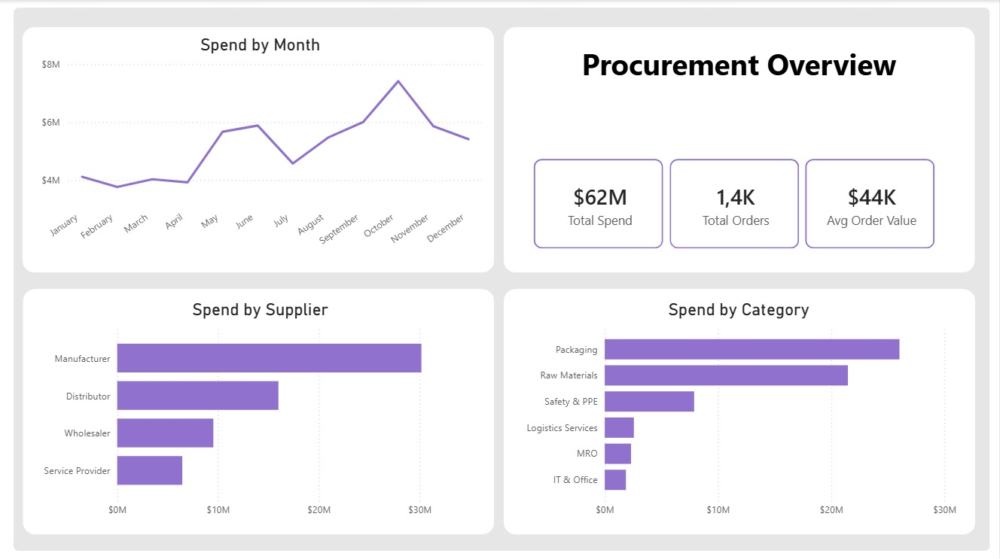
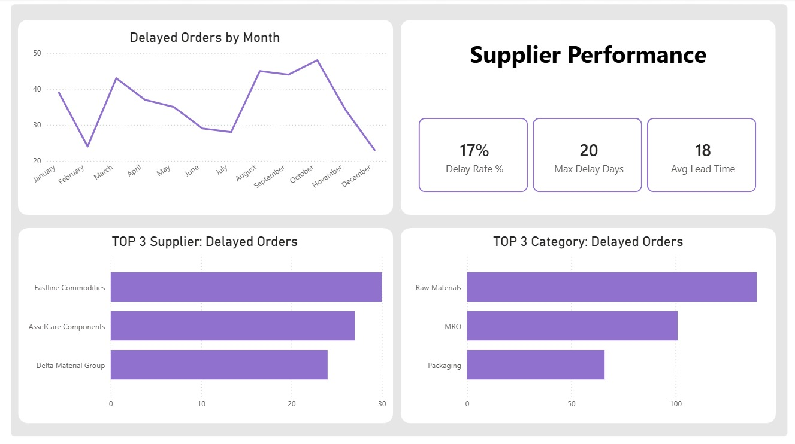
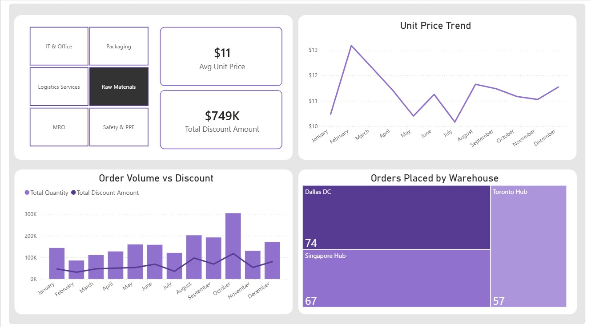

# power-bi-procurement-analysis
Procurement analytics dashboard using Power BI

## Business Questions
- Why did procurement spend significantly increase in October?
- Which suppliers cause the most delivery delays in the top category (raw materials)?
- Were discounts applied when purchase volumes increased?

## Dataset
Synthetic procurement dataset including:
- Purchase orders
- Suppliers
- Products and categories
- Delivery and lead time metrics
- Discounts and pricing
Time period: 2024–2025

## Dashboard

### Procurement Overview

### Supplier Performance

### Discount Analysis

## Approach
- Analyzed procurement data by month, category, and supplier
- Focused on the top category: raw materials
- Compared purchase volume vs average unit price
- Evaluated delivery delays by supplier
- Investigated relationship between order size and discounts

## Key Insights
1. October Spend Spike
- The increase in October was driven by higher purchase volume, not price
- Average unit price remained relatively stable
- Raw materials category contributed the most to the spike
 This indicates operational demand rather than price inflation

---

### 2. Supplier Risk (Delta Materials Group)
Delta Materials Group accounts for only 4% of total spend but shows a high delay rate (21%) 
and long lead time (30 days), with delays reaching up to 20 days.
This indicates a high operational risk, especially since the supplier operates in the raw materials category.

---

### 3. Discounts vs Volume
In general, discounts increased in October when orders were delayed
Bulk purchases without delays did not significantly reduce unit price

---

## Tools Used
- Power BI (data modeling, DAX, dashboard)
- Power Query (data cleaning)
